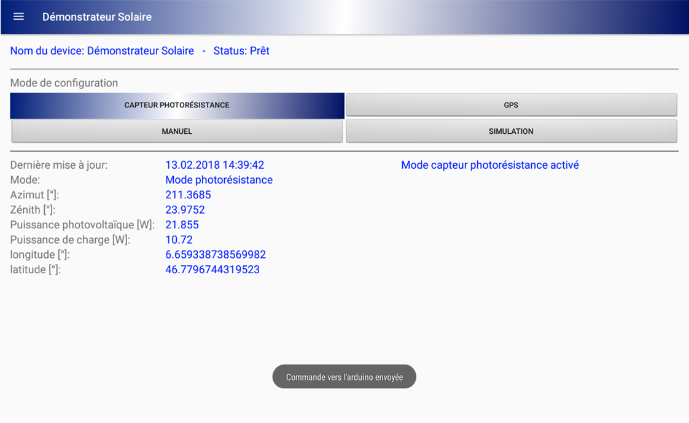

# Démonstrateur Solaire 

## Vincent Huguelet 

## Structure du repo 

1. Code Application Android pour le pilotage du panneau solaire.
2. Extrait uniquement de la boussole du code de l'app "Démonstrateur Solaire". 
3. Code du module Adafruit. 

## Résumé du projet 

### Introduction 

L'énergie solaire… une source d'énergie gratuite et à disposition de tous. L'utilisation de cette énergie commence à se démocratiser, cependant, le grand public s'y perd. Quoi de mieux qu'un démonstrateur solaire afin d'aider Monsieur tout le monde à mieux s'y retrouver ?

### Le démonstrateur Solaire

Dans cette optique, un démonstrateur solaire a vu le jour. Ce dernier consiste en une petite installation photovoltaïque électrique autonome, accompagnée d'un système suiveur en deux modes (capteur de lumière & calcul de la position solaire) accompagnée d'une application Android.

> Figure 1: Illustration du démonstrateur.

### Différents aspects du démonstrateur

Le démonstrateur présenté a été entièrement réalisé sur mesure, du dimensionnement mécanique : 

> Figure 2: Illustration de l'aspect mécanique. 

en passant par le dimensionnement électrique (et électronique) :

> Figure 3: Schéma de principe de la partie électrique. 

à l'application Android : 

> Figure 4: Screen-shot de l'application en mode "photorésistances". 

### Conclusion 

Le démonstrateur est globalement fonctionnel dans les différentes modes.
L'aspect pluridisciplinaire du projet l'a autant complexifié que rendu intéressant.
